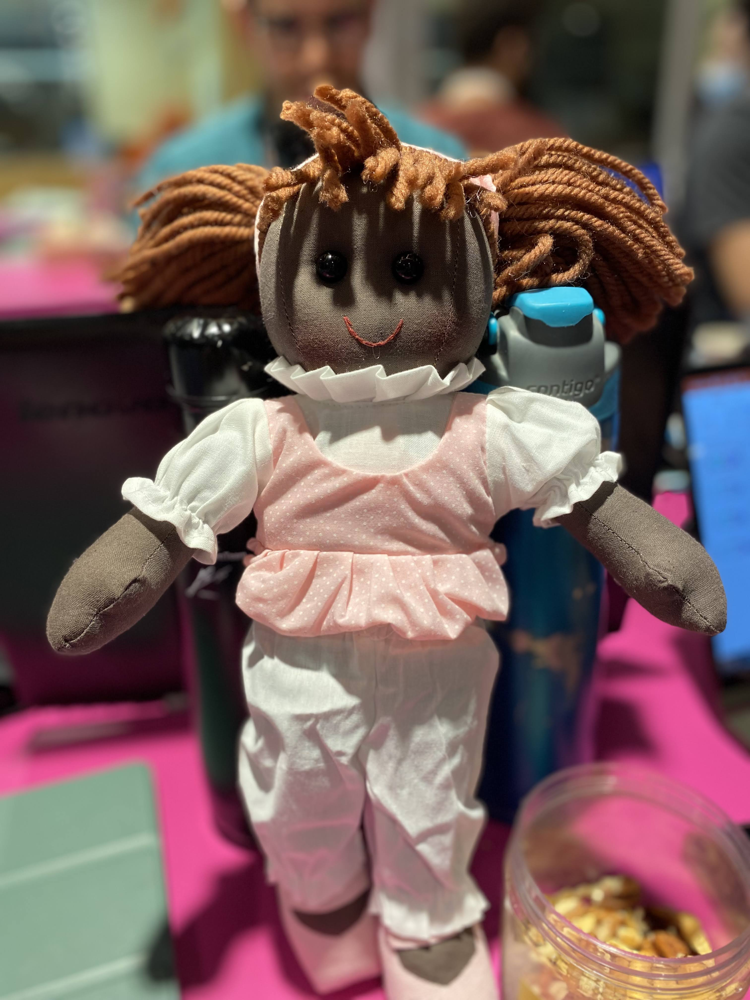
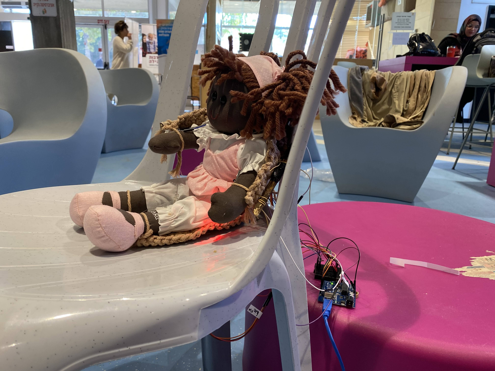

# ALLess
A Hackathon project to control a doll movement with your eyes\

### The idea
We wanted to improve the lives of ALS patients.\
Due to their illness, ALS patients often loose the ability to move their limbs. This disability can cause several side effects including but not limited to:
* Edema
* Muscle degeneration
* Numbness
* Swelling
* Sore muscles

We wanted to address those side effects, and at the same time grant more independence to ALS patients. 
Our idea was to develop an exoskeleton that would be mounted on the patient's wheelchair. The exoskeleton would then be attached to the patient's limbs. Using a mobile phone/laptop placed in front of the patient, the patient could control the exoskeleton to move specific limbs. Moving the limbs will help reduce pain, stretch the muscles, and potentially even delay the muscle degeneration.\
Due to their illness, many patients won't even be able to control the phone/laptop normally. To overcome this, we made it possible to control the software with the patient eyes (ALS patients can usually perform eye movement until very advanced stages of the disease). 

### POC
We developed the POC during the BGU Brainstorm Hackathon.\
Our POC shows a complete working example of our idea on a doll instead of a human being.\

The doll is connected to the "wheelchair" and strapped to 2 motors. The motors are associated with the doll's hands. A user can use their eyes to choose a body part (left/right hands, pelvis, chest). If one of the doll's hands are selected, they will be stretched and moved. If the pelvis/chest area are selected, a corresponding light will blink.

### How it works
The project is divided into 3 main modules.
1. [The eye tracker](https://github.com/rosenpin/EyeTracker)
2. [The graphical user interface](https://github.com/rosenpin/HackathonGUI) the user interacts with
3. [The motor control + server communication](https://github.com/rosenpin/ALLess/blob/main/doll_arduino.ino)

The eye tracker program sets up an HTTP server.\
The user interface communicates with the eye tracker HTTP server to present the user with correct information and eye tracking indication.
In addition, the graphical user interface provides an option to view the history of selected limbs. This is tracked and stored so the patient's therapist can later view this information and adjust the treatment accordingly.\

### TODO
* upload and update motor control + server communication repo link 
